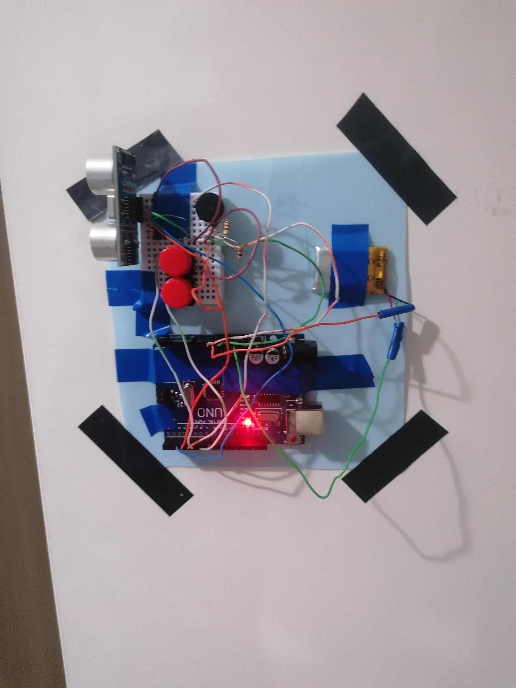

\# Cabinet Alarm System 🔒

## Project Preview



## Demo Video

[▶ Watch the demo video](videos/demo.mp4)
  
An Arduino-based cabinet security alarm system designed to detect unauthorized cabinet opening using an HC-SR04 ultrasonic sensor.


The system activates a buzzer alarm when motion is detected near the cabinet. It is powered by a Li-ion battery, making it portable and suitable for small security applications.


\## Features


\- HC-SR04 ultrasonic distance sensor for detection

\- Buzzer alarm system

\- Li-ion battery powered

\- Two push buttons

\- Alarm mute button with 10-second silence function

\- Fake button for additional security appearance

\- Simple Arduino implementation


\## Components Used


| Component | Quantity |

|---|---|

| Arduino board | 1 |

| HC-SR04 Ultrasonic Sensor | 1 |

| Buzzer | 1 |

| Li-ion Battery | 1 |

| 4-pin Push Buttons | 2 |

| Connecting wires | - |


\## Pin Connections


| Component | Arduino Pin |

|---|---|

| HC-SR04 TRIG | D2 |

| HC-SR04 ECHO | D3 |

| Buzzer | D4 |

| Button 1 (Alarm mute) | D5 |

| Button 2 (Fake button) | D6 |


\## Button Functions


\### Button 1

The first button temporarily disables the buzzer alarm for \*\*10 seconds\*\*.


This allows the user to open the cabinet without the alarm continuously sounding.


\### Button 2

The second button currently has no function.


It is included as a fake security button to make the system look more complex.


\## How It Works


1\. The HC-SR04 sensor continuously measures distance.

2\. If an object is detected within the programmed range, the alarm is triggered.

3\. The buzzer starts producing an alert sound.

4\. Pressing Button 1 disables the buzzer for 10 seconds.

5\. After the mute period ends, the alarm system becomes active again.


\## Wiring Diagram


```

HC-SR04

\-------------

VCC  -> 5V

GND  -> GND

TRIG -> D2

ECHO -> D3


Buzzer

\-------------

\+ -> D4

\- -> GND


Button 1

\-------------

Pin -> D5

Pin -> GND


Button 2

\-------------

Pin -> D6

Pin -> GND

```


\## Power


The system is powered using a Li-ion battery.


Battery power allows the cabinet alarm to operate without a permanent USB connection.


\## Project Structure


```

Cabinet\_alarm/

│

├── Cabinet\_alarm.ino

├── README.md

└── LICENSE

```


\## License


This project is licensed under the MIT License.


You are free to use, modify and distribute this project.


